<p align="center">
  
</p>

```text
 █████╗  ██████╗██╗  ██╗██╗███████╗██╗   ██╗███████╗███╗   ███╗███████╗███╗   ██╗████████╗
██╔══██╗██╔════╝██║  ██║██║██╔════╝██║   ██║██╔════╝████╗ ████║██╔════╝████╗  ██║╚══██╔══╝
███████║██║     ███████║██║█████╗  ██║   ██║█████╗  ██╔████╔██║█████╗  ██╔██╗ ██║   ██║
██╔══██║██║     ██╔══██║██║██╔══╝  ╚██╗ ██╔╝██╔══╝  ██║╚██╔╝██║██╔══╝  ██║╚██╗██║   ██║
██║  ██║╚██████╗██║  ██║██║███████╗ ╚████╔╝ ███████╗██║ ╚═╝ ██║███████╗██║ ╚████║   ██║
╚═╝  ╚═╝ ╚═════╝╚═╝  ╚═╝╚═╝╚══════╝  ╚═══╝  ╚══════╝╚═╝     ╚═╝╚══════╝╚═╝  ╚═══╝   ╚═╝
```

<p align="center">
  
  
  
  
  
</p>

# 🏆 Achievement Badges for Jellyfin

A full progression, gamification and achievement system for Jellyfin that rewards users based on real viewing activity. Think Xbox Gamerscore meets Letterboxd, built natively into your media server.

> **Status:** Active development — v1.5.37 adds user preferences, privacy controls, admin feature toggles, achievement page themes, Xbox-style toasts with sound, and diamond animations for legendary/mythic unlocks.

---

## ✨ Overview

Over **170 built-in achievements** across 30+ categories, a 10-tier rank ladder from Rookie to Immortal, a score economy with combos, prestige, and daily/weekly quests, plus admin power features like custom badges, seasonal challenges, webhook notifications and a full audit log.

Designed to integrate cleanly with modern Jellyfin setups and themes like NetFin, ElegantFin, or StarTrack.

---

## 🧩 Core features

### 🏅 Badge system
- **170+ built-in achievements** across Films, Series, Binge, Night Watching, Morning, Weekend, Exploration, Streaks, Episode/Film Marathons, Eras, World, Languages, Genres, Runtime, Total Time, Holidays (Christmas, New Year, Halloween, Eid), Library Completion, Loyalty, People, Rewatch, and Hidden categories
- **6 rarity tiers** — Common, Uncommon, Rare, Epic, Legendary, Mythic
- **Hidden/secret badges** displayed as `???` until unlocked
- **Library completion milestones** that auto-scale to any library structure
- **Per-person tracking** — Director and Actor affinity badges
- **Per-genre tracking** — unique genre counters with dedicated badges
- **Era / country / language** breakdowns via item metadata
- **Watch streaks** — current and best streak badges
- **Daily login streak** — loyalty rewards for consistent visits

### 🎖️ Rank system
- **10 tiers** from Rookie → Novice → Viewer → Regular → Enthusiast → Binger → Connoisseur → Maestro → Legend → Immortal
- Rank computed from your achievement score with progress bar to next tier
- **Theme unlocks** — the achievements page changes gradient/border color as you climb
- Sidebar badge showcase + header dots display your current equipped badges at a glance

### 💰 Score economy
- Every playback accrues 5 base points into a **score bank**
- **Combo multiplier** — consecutive watches within 15 minutes stack up to +100% bonus
- **Spend bank** to buy locked badges directly
- **Gift score** to other users on your server
- Rarity-based badge scoring (10-150 pts), scaled by prestige level

### ⭐ Prestige
- Reach Legend rank (12,000 score) to unlock prestige
- **Resets badges + counters** but keeps your lifetime score and awards a prestige star
- Each prestige level adds a **+50% score multiplier** to future badge unlocks
- Visible on profile and leaderboard

### 🎯 Daily & weekly quests
- **3 concurrent daily quests** rotating from 12 templates
- **3 concurrent weekly quests** rotating from 8 templates
- Deterministic rotation — everyone on the server gets the same quests per day/week
- Completing quests pays into the score bank

### 📊 Stats & visualization
- **Recap tab** — weekly / monthly / yearly breakdowns with top genres, directors, actors
- **Watch heatmap** — GitHub-style calendar (30/90/180/365 day range) colored by intensity
- **Genre radar chart** — SVG spider chart of your genre distribution
- **Stats snapshot** — histogram of unlocked / score / best streak
- **Category leaderboards** — Score, Movies, Episodes, Hours, Best Streak, Series

### 🏠 UI integration
- **Sidebar entry** auto-injected into the Jellyfin nav menu (works on web, iOS, and Android after restart)
- **Equipped badge showcase** in header + profile (configurable slot count, 1-10)
- **Xbox-style unlock toasts** with per-rarity colors (6 tiers), Xbox logo → trophy swap, shimmer sweep, and confetti on rare+ unlocks
- **Achievement sound** — Xbox 360 chime for common/uncommon, rare Xbox One chime for rare/epic/legendary/mythic
- **Diamond spritesheet** for legendary/mythic unlocks (147-frame rotating crystal animation)
- **One-at-a-time toast queue** — multiple simultaneous unlocks play sequentially so each gets its full animation
- **Toasts during playback** — unlocks fire within ~1s of earning via playback event hooks + DOM fallback
- **Admin toast preview** — test buttons for each rarity tier
- **Standalone achievements page** at `#!/achievements`
- **Shareable profile card** — server-rendered HTML at `/Plugins/AchievementBadges/users/{id}/profile-card`

### ⚙️ User preferences
A gear icon on the achievements page opens a full settings panel with auto-save:
- **Toast controls** — enable/disable toasts, sound, confetti, milestone toasts
- **Minimum toast rarity** — filter out common spam (All / Rare+ / Epic+ / Legendary+)
- **Privacy** — hide from leaderboard, compare profiles, activity feed, prestige board
- **Achievement page themes** — Default, Dark, or Light (scoped to achievements page only, doesn't affect Jellyfin)
- **Spoiler mode** — hides locked badge descriptions with "???" so you discover them naturally
- **Equipped badge slots** — choose how many badges show in your showcase (1-10)
- **Auto-equip new unlocks** — newly earned badges automatically fill empty slots

### 🛠️ Admin features
- **Feature Controls** — kill switches for leaderboard, compare, activity feed, prestige, quests
- **Force Privacy Mode** — override all users to hidden from all social features
- **Max Equipped Badges** — server-wide cap (1-10)
- **Restrict Badge Visibility** — users can only see their own badges
- **Disable Badge Categories** — hide entire categories (e.g. "Late Night" for family servers)
- **Custom Welcome Message** — text shown on the achievements page
- **Reset User Progress** — wipe a specific user's badges via admin endpoint
- **Enable/disable individual badges** — useful if your server can't satisfy some criteria
- **Visual badge editor** — form-based creator for custom badges
- **JSON editor** alternative for power users
- **Seasonal challenges** — time-limited goals with start/end dates
- **Challenge templates** — one-click add for Monthly Marathon, October Horror, New Year, Summer Blockbuster
- **Webhook notifications** — Discord/Slack-compatible POST on every unlock
- **Audit log** — last 5,000 unlock events with timestamps
- **Progress injection** — set arbitrary counter values for testing / gifting
- **Admin auth lockdown** — all admin endpoints require elevated permissions

### 🔒 Tracking
- **Watch history backfill** — scans existing Jellyfin play history to retroactively award badges on install
- **Auto-evaluation on startup** — new badges from plugin updates auto-unlock if your existing counters already satisfy them, no manual scan needed
- **Live playback tracker** — unlocks fire during viewing, past the 80% completion threshold
- **Rewatch detection** — dedupes within 6 hours, counts rewatches beyond that
- **People metadata extraction** — uses `ILibraryManager.GetPeople()` for directors/actors

---

## ⚙️ Installation

1. Go to **Dashboard → Plugins → Repositories**
2. Add:

```
https://raw.githubusercontent.com/ZL154/AchievementBadges_for_Jellyfin/main/manifest.json
```

3. Save and refresh plugins
4. Install **Achievement Badges**
5. Restart Jellyfin
6. Go to **Dashboard → Plugins → Achievement Badges → Settings**
7. Click **Scan watch history** (or **Scan all users**) to backfill from your existing play data
8. Explore `#!/achievements` to see your profile

---

## 🔧 Requirements

- **Jellyfin 10.11+**
- **File Transformation plugin** (strongly recommended) — ensures sidebar, dashboard UI, profile showcase and achievements page inject reliably across Jellyfin Web updates. Without it most UI injection still works via the plugin's own middleware, but File Transformation gives the most robust integration.

### Optional but helpful

- **Proper metadata provider** (TMDb, OMDb) — required for Director/Actor badges to populate. Badges based on `item.People` will stay empty if your library doesn't have people scraped
- **Home Screen Sections plugin** — lets the achievement home widget inject more reliably

### What each feature needs

| Feature | Depends on |
|---|---|
| Sidebar + header injection | Nothing (works standalone) |
| Watch history backfill | Played flag on items (Jellyfin default) |
| Genre badges | Items with `Genres` metadata |
| Director/Actor badges | Items with `People` metadata (TMDb/OMDb scrape) |
| Era / decade badges | Items with `ProductionYear` metadata |
| Country badges | Items with `ProductionLocations` metadata |
| Language badges | Items with `OriginalLanguage` metadata |
| Runtime badges | Items with `RunTimeTicks` populated |
| Library completion | At least one library folder with items |
| Webhook notifications | A webhook URL (Discord, Slack, or generic) |

---

## 🔍 Troubleshooting

### Sidebar / toasts / UI not showing up

The plugin injects its scripts into Jellyfin's `index.html` at startup. If the web directory isn't writable, the injection fails silently and no UI loads (no sidebar entry, no toasts, no achievements page).

**Diagnose:** visit `https://your-server/Plugins/AchievementBadges/test` — the JSON response shows:
- `DiagIndexFound` — whether `index.html` was located
- `DiagIndexPatched` — whether the script tags were successfully written
- `DiagLastError` — the exact error if patching failed (usually `Unauthorized: Access denied`)

**Common cause:** on Docker or Linux installs, Jellyfin doesn't have write access to `/usr/share/jellyfin/web/`. Fix by granting write permission:

```bash
# Docker: run inside the container
chmod -R a+w /usr/share/jellyfin/web/

# Systemd: fix ownership
sudo chown -R jellyfin:jellyfin /usr/share/jellyfin/web/
```

Then restart Jellyfin. The plugin will patch `index.html` on the next startup.

**Still broken?** The plugin has a middleware fallback that rewrites `index.html` at runtime (no disk write needed). If that's also failing, check whether a reverse proxy (nginx/Caddy) is caching a stale `index.html` from before the plugin was installed. Clear the proxy cache or restart it.

---

## 📡 API endpoints

### User-facing (require auth)
```
GET    /Plugins/AchievementBadges/users/{userId}                      — full badge list
GET    /Plugins/AchievementBadges/users/{userId}/summary              — unlocked/total/score
GET    /Plugins/AchievementBadges/users/{userId}/rank                 — rank tier + next tier
GET    /Plugins/AchievementBadges/users/{userId}/equipped             — equipped badges
POST   /Plugins/AchievementBadges/users/{userId}/equipped/{badgeId}
DELETE /Plugins/AchievementBadges/users/{userId}/equipped/{badgeId}
GET    /Plugins/AchievementBadges/users/{userId}/recap?period=week|month|year
GET    /Plugins/AchievementBadges/users/{userId}/watch-calendar?days=90
GET    /Plugins/AchievementBadges/users/{userId}/quests               — daily + weekly
GET    /Plugins/AchievementBadges/users/{userId}/daily-quest
GET    /Plugins/AchievementBadges/users/{userId}/weekly-quest
GET    /Plugins/AchievementBadges/users/{userId}/bank                 — score bank + prestige
POST   /Plugins/AchievementBadges/users/{userId}/prestige
POST   /Plugins/AchievementBadges/users/{userId}/buy-badge/{badgeId}
POST   /Plugins/AchievementBadges/users/{userId}/gift/{toUserId}?amount=N
GET    /Plugins/AchievementBadges/users/{userId}/chase/{badgeId}      — items to watch to finish a badge
GET    /Plugins/AchievementBadges/users/{userId}/recommendations      — top 3 closest-to-unlock
GET    /Plugins/AchievementBadges/users/{userId}/profile-card         — HTML profile card
GET    /Plugins/AchievementBadges/users/{userId}/unlocks-since?since=ISO
GET    /Plugins/AchievementBadges/users/{userId}/library-completion
POST   /Plugins/AchievementBadges/users/{userId}/login-ping
GET    /Plugins/AchievementBadges/leaderboard?limit=10
GET    /Plugins/AchievementBadges/leaderboard/{category}?limit=10     — score|movies|episodes|hours|streak|series
GET    /Plugins/AchievementBadges/server/stats
```

### Admin-only (require `RequiresElevation`)
```
POST   /Plugins/AchievementBadges/users/{userId}/backfill
POST   /Plugins/AchievementBadges/backfill-all
POST   /Plugins/AchievementBadges/users/{userId}/reset
POST   /Plugins/AchievementBadges/users/{userId}/reset-badge/{badgeId}
POST   /Plugins/AchievementBadges/users/{userId}/library-completion/recompute
POST   /Plugins/AchievementBadges/users/{userId}/import
GET    /Plugins/AchievementBadges/users/{userId}/export
GET/POST  /Plugins/AchievementBadges/admin/badge-catalog              — enable/disable badges
GET/POST  /Plugins/AchievementBadges/admin/custom-badges              — custom badge definitions
GET/POST  /Plugins/AchievementBadges/admin/challenges                 — seasonal challenges
GET       /Plugins/AchievementBadges/admin/challenge-templates        — one-click templates
GET/POST  /Plugins/AchievementBadges/admin/webhook                    — webhook config
GET/POST  /Plugins/AchievementBadges/admin/ui-features                — UI feature toggles
GET       /Plugins/AchievementBadges/admin/audit-log?limit=200
POST      /Plugins/AchievementBadges/admin/users/{userId}/inject-counters
GET/POST  /Plugins/AchievementBadges/admin/feature-config              — feature kill switches + admin controls
DELETE    /Plugins/AchievementBadges/admin/users/{userId}/reset         — wipe user's achievement progress
```

---

See the [Releases page](https://github.com/ZL154/AchievementBadges_for_Jellyfin/releases) for full notes.

---

## 📸 Screenshots

### Xbox-style unlock toast
Pops up during playback when a badge unlocks. Xbox circle pops in with pulse rings, expands into a banner, trophy rotates (or diamond spritesheet for rare unlocks), text slides up, shimmer sweeps across, then everything collapses. Per-rarity color, glow, and sound.

<p align="center">
  
</p>

> **Live demo:** download [`achievement-combined.html`](assets/achievement-combined.html) (regular) or [`achievement-combined-rare.html`](assets/achievement-combined-rare.html) (rare with diamond) and open in a browser. Click anywhere to start the sound. Loops every 10.5s.

### The standalone Achievements page
The full profile view, shown in the Jellyfin sidebar. Rank progress bar, day streak, score, completion percentage, and the tab bar for the seven sub-views (My Badges, Quests, Recap, Leaderboard, Compare, Activity, Wrapped, Stats).

<p align="center">
  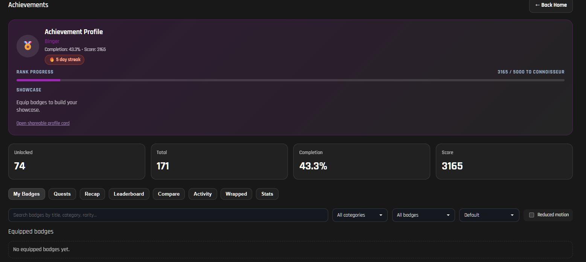
</p>

### Badge grid
171 badges across 30+ categories, each with live progress bars and an Equip button. Unlocked badges show in color with a green status tag; locked badges dim. Rarity-colored borders let you scan the grid visually.

<p align="center">
  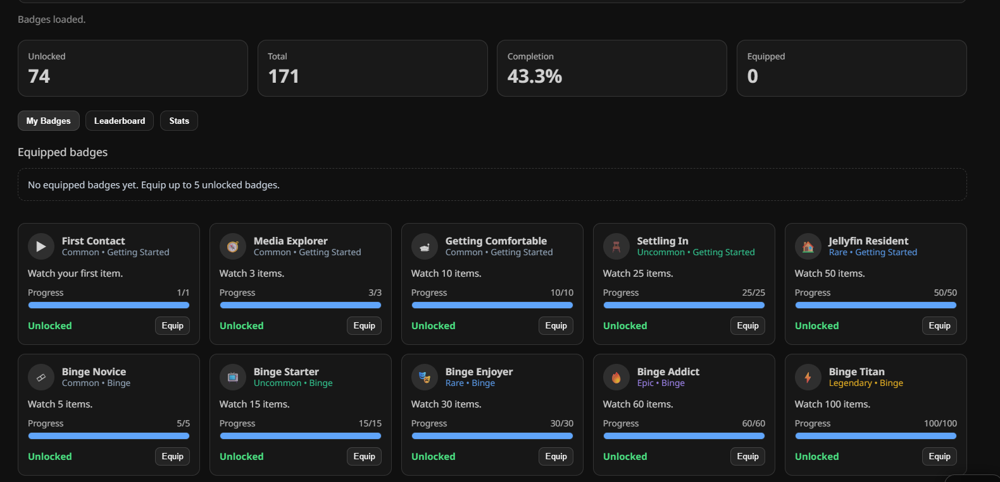
</p>

### Rarity tiers in action
Genre specialist badges and streak extremes across all six rarity colors — Common, Uncommon, Rare, Epic, Legendary, Mythic.

<p align="center">
  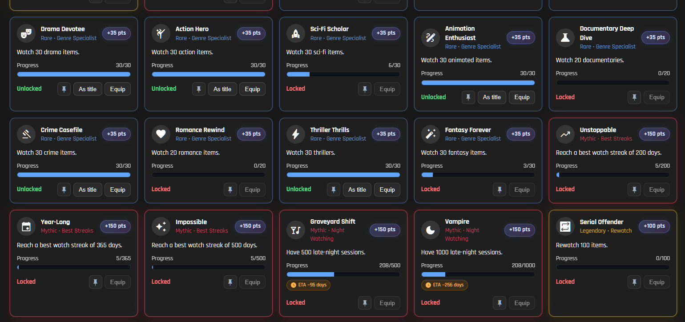
</p>

### Daily and weekly quests
Rotating quests from a template pool. Everyone on the server gets the same daily + weekly challenges so people can race each other. Completing them pays into the score bank.

<p align="center">
  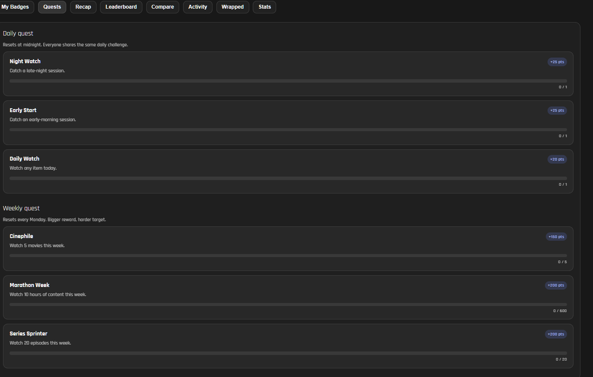
</p>

### Recap
Weekly, monthly and yearly breakdowns of what you've actually watched — total items, active days, top genres, top directors, and top actors.
<p align="center">
  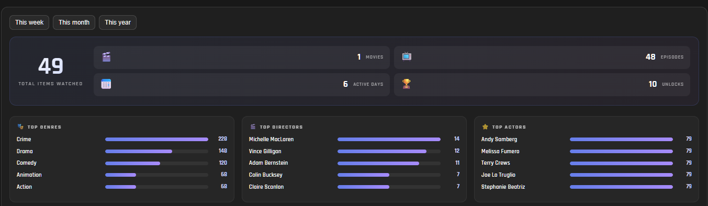
</p>

### Year Wrapped
Spotify-style end-of-year recap with a big gradient hero, "your numbers" (movies, episodes, active days, best streak, total hours), "your highlights" (biggest day, biggest month, most-watched weekday) and "your favorites" (top genres/directors/actors).

<p align="center">
  
</p>

### Leaderboard
Podium view for the top 3, ranked list below. Switch categories with the tab row: Score, Movies, Episodes, Hours, Best Streak, Series. (Usernames blurred as User 1–10.)

<p align="center">
  
</p>

### Compare profiles
Head-to-head profile comparison between any two users on your server. Gradient bars show the relative values on 12 core metrics, and the bottom pills break down how many badges each user has that the other doesn't. (Usernames blurred as User 1 / User 2.)

<p align="center">
  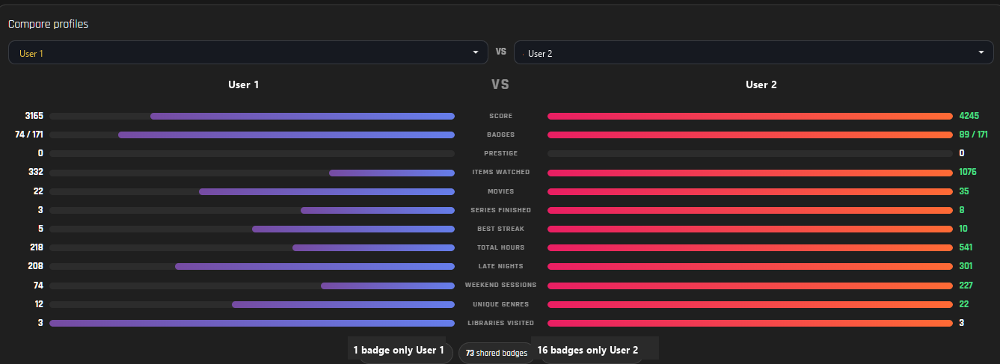
</p>

### Streak calendar
GitHub-style year calendar of your watch activity. Current streak, best ever, and total active days at a glance.

<p align="center">
  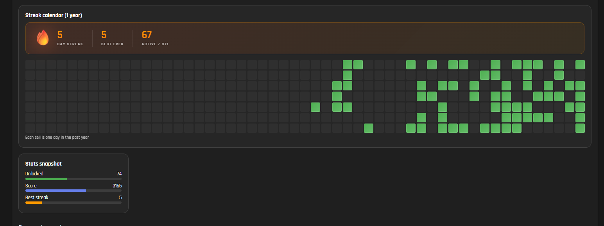
</p>

### Watch heatmap
90-day heatmap grid, colored by daily watch volume. Click the range button to switch between 30/90/180/365 days.

<p align="center">
  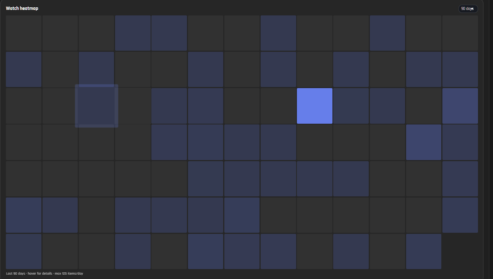
</p>

### Genre radar + watch clock
SVG spider chart showing your top-5 genre distribution, and a 24-hour polar chart of when you actually watch.

<p align="center">
  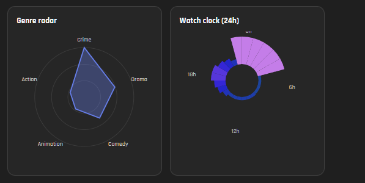
</p>

### Admin panel
Every admin section is collapsible so the page stays clean: webhook notifications, toast preview, UI feature toggles, visual badge editor, challenge templates, audit log, progress injection, custom badges, seasonal challenges, and per-badge enable/disable.

<p align="center">
  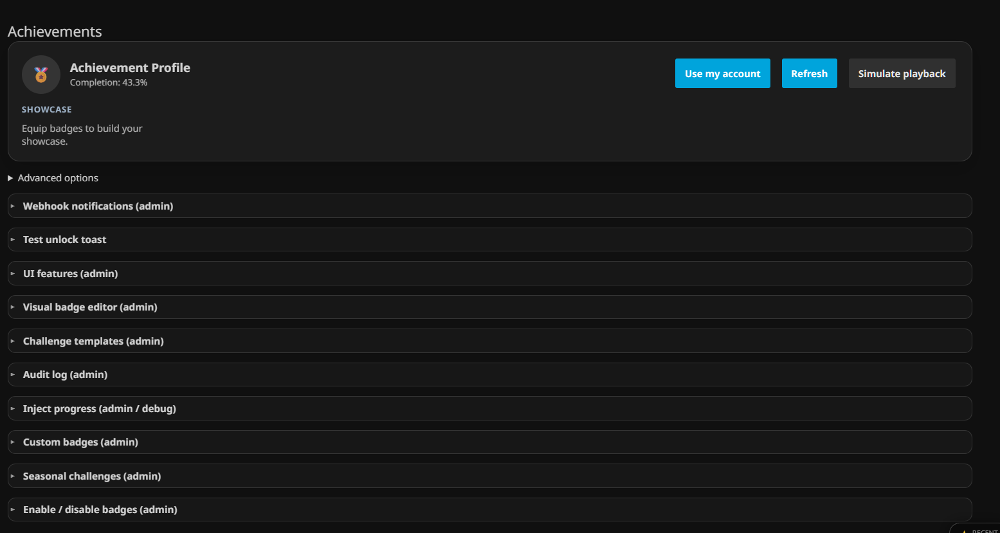
</p>

### Advanced options
Scan watch history, reset badges, scan all users, or load a specific user ID — all from one row under the Advanced options toggle.

<p align="center">
  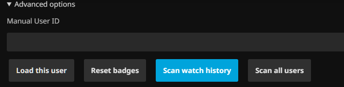
</p>

### Sidebar entry
Auto-injected into the Jellyfin nav menu — no theme changes required.

<p align="center">
  
</p>

---

## 📜 License

This project is released under the [MIT License](LICENSE) — one of the most permissive open-source licenses in common use.

**Summary:**

| You can | You must | You cannot |
|---|---|---|
| Use it on any Jellyfin server, personal or commercial | Keep the copyright + license notice in any redistribution | Hold the authors liable if something breaks |
| Fork and modify however you want | | Claim the authors endorse your fork |
| Redistribute modified or unmodified copies | | |
| Bundle it with proprietary software | | |
| Include it in a paid product | | |

If you just want to *run* the plugin, none of this affects you — install it and enjoy.

### Contributions

Pull requests are welcome. By submitting a contribution you agree that your changes will be licensed under the same MIT terms. Keep contributions focused (one feature or fix per PR) and include a short description of what changed and why in the PR body.

### Third-party attributions

- **Jellyfin** (GPL-2.0) — this plugin is a third-party extension for [Jellyfin](https://jellyfin.org/) and is not affiliated with or endorsed by the Jellyfin project. At build time it references `Jellyfin.Controller` and `Jellyfin.Model` NuGet packages, which remain under their own GPL-2.0 license.
- **Xbox-style unlock toast** — the animation style is inspired by [Adam Cosman's Xbox One Achievement codepen](https://codepen.io/AdamCosman/pen/eYpNYgy) and was reimplemented from scratch. No original assets from that codepen ship with this plugin.
- **Material Icons** (Apache 2.0) — icon glyphs referenced in the UI are provided by Jellyfin's own web client and are licensed by Google.

See [LICENSE](LICENSE) for the full license text and third-party notices.

---

⭐ If you use this plugin, consider starring the repository.
